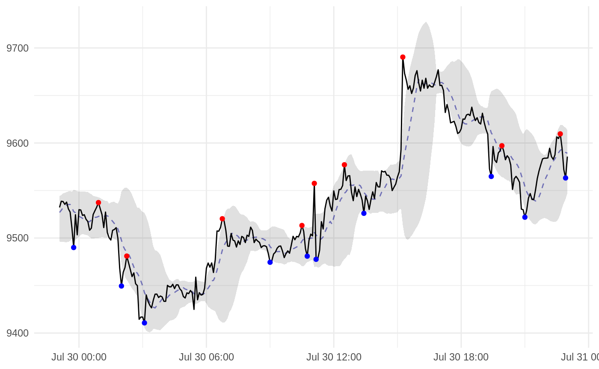
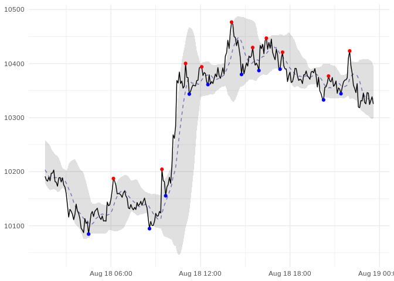

# quantrecipes

<!-- badges: start -->

[](https://www.tidyverse.org/lifecycle/#experimental)
[](https://travis-ci.org/bagasbgy/quantrecipes)
<!-- badges: end -->

## Installation

You can install the development version of `quantrecipes` using:

``` r
# install.packages("remotes")
remotes::install_github("bagasbgy/quantrecipes")
```

## Getting Started

Let’s start by importing the library:

``` r
# import libs
library(quantrecipes)
```

Here’s a quick example for setting-up a recipe to produce ZigZag,
Bollinger Bands, and moving average:

``` r
# an example recipe
rec <- recipe(. ~ ., data = btcusdt) %>% 
  step_zigzag(close, change = 0.5, state = TRUE, span = c(1, -1)) %>% 
  step_bbands(high, low, close) %>% 
  step_ma(close) %>% 
  step_naomit(all_predictors()) %>% 
  prep()

# quick check
juice(rec)
#> # A tibble: 26,155 x 15
#>    datetime             open  high   low close volume turnover zigzag_value
#>    <dttm>              <dbl> <dbl> <dbl> <dbl>  <dbl>    <dbl>        <dbl>
#>  1 2019-05-01 01:35:00 5340. 5340. 5331. 5331. 0.510     2722.        5348.
#>  2 2019-05-01 01:40:00 5338. 5339. 5333  5333  0.402     2146.        5349.
#>  3 2019-05-01 01:45:00 5335. 5337. 5333  5336. 0.819     4368.        5351.
#>  4 2019-05-01 01:50:00 5336. 5337. 5336. 5337. 0.0199     106.        5352.
#>  5 2019-05-01 01:55:00 5338. 5340. 5336. 5340. 1.39      7437.        5354.
#>  6 2019-05-01 02:00:00 5342. 5344. 5342  5344. 1.03      5504.        5355.
#>  7 2019-05-01 02:05:00 5344. 5352. 5344  5352. 1.26      6716.        5356.
#>  8 2019-05-01 02:10:00 5353  5355. 5348. 5348. 0.191     1020.        5358.
#>  9 2019-05-01 02:15:00 5349. 5369. 5348. 5362. 0.310     1661.        5359.
#> 10 2019-05-01 02:20:00 5361. 5362. 5355. 5355. 0.356     1908.        5361.
#> # … with 26,145 more rows, and 7 more variables: zigzag_trend <fct>,
#> #   zigzag_swing <fct>, bbands_dn <dbl>, bbands_ma <dbl>, bbands_up <dbl>,
#> #   bbands_pctb <dbl>, ma_close_value <dbl>
```

This example recipe would be very helpful for preparing data for further
analysis. For example, here is a quick visualization:

``` r
# import libs
library(ggplot2)

# quick visualization
data_viz <- juice(rec) %>% 
  tail(12 * 24)

data_highlight <- data_viz %>% 
  drop_na() %>% 
  filter(zigzag_swing != "hold")

ggplot(data_viz, aes(x = datetime, y = close)) +
  geom_ribbon(aes(ymin = bbands_dn, ymax = bbands_up), alpha = 0.15) +
  geom_line(aes(y = ma_close_value), colour = "darkblue", linetype = "dashed", alpha = 0.5) +
  geom_line() +
  geom_point(data = data_highlight, aes(colour = zigzag_swing)) +
  scale_colour_manual(values = c("up" = "blue", "down" = "red")) +
  guides(colour = FALSE) +
  labs(x = NULL, y = NULL) +
  theme_minimal()
```



Since we have the recipes object, this approach also very helpful to
preprocess new data:

``` r
# import libs
library(rucoin)

# get new data
btcusdt_new <- get_kucoin_prices(
  symbols = "BTC/USDT",
  from = "2019-08-18",
  to = "2019-08-19",
  frequency = "5 minutes"
)

# get preprocess result for new data
bake(rec, btcusdt_new)
#> # A tibble: 264 x 15
#>    datetime              open   high    low  close volume turnover
#>    <dttm>               <dbl>  <dbl>  <dbl>  <dbl>  <dbl>    <dbl>
#>  1 2019-08-18 01:35:00 10173. 10198. 10173. 10191.   42.6  434072.
#>  2 2019-08-18 01:40:00 10192. 10195. 10171. 10184.   64.1  652153.
#>  3 2019-08-18 01:45:00 10184. 10184. 10164. 10182.   53.5  544848.
#>  4 2019-08-18 01:50:00 10182. 10193  10180  10190.   26.2  266446.
#>  5 2019-08-18 01:55:00 10190. 10192. 10177. 10183.   50.9  518042.
#>  6 2019-08-18 02:00:00 10182  10203. 10178. 10197.   46.7  475847.
#>  7 2019-08-18 02:05:00 10193. 10205. 10192. 10197.   25.5  260335.
#>  8 2019-08-18 02:10:00 10197. 10204. 10197. 10203.   23.8  242407.
#>  9 2019-08-18 02:15:00 10204. 10204. 10180. 10182.   38.8  395315.
#> 10 2019-08-18 02:20:00 10182. 10188. 10180. 10180.   21.7  220920.
#> # … with 254 more rows, and 8 more variables: zigzag_value <dbl>,
#> #   zigzag_trend <fct>, zigzag_swing <fct>, bbands_dn <dbl>,
#> #   bbands_ma <dbl>, bbands_up <dbl>, bbands_pctb <dbl>,
#> #   ma_close_value <dbl>
```

Thus, make a reproducible analysis for new data easier too:

``` r
# quick visualization
data_viz <- bake(rec, btcusdt_new)

data_highlight <- data_viz %>% 
  drop_na() %>% 
  filter(zigzag_swing != "hold")

ggplot(data_viz, aes(x = datetime, y = close)) +
  geom_ribbon(aes(ymin = bbands_dn, ymax = bbands_up), alpha = 0.15) +
  geom_line(aes(y = ma_close_value), colour = "darkblue", linetype = "dashed", alpha = 0.5) +
  geom_line() +
  geom_point(data = data_highlight, aes(colour = zigzag_swing)) +
  scale_colour_manual(values = c("up" = "blue", "down" = "red")) +
  guides(colour = FALSE) +
  labs(x = NULL, y = NULL) +
  theme_minimal()
```


